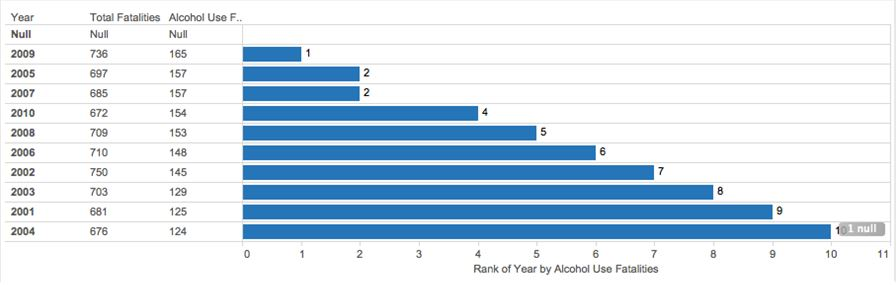
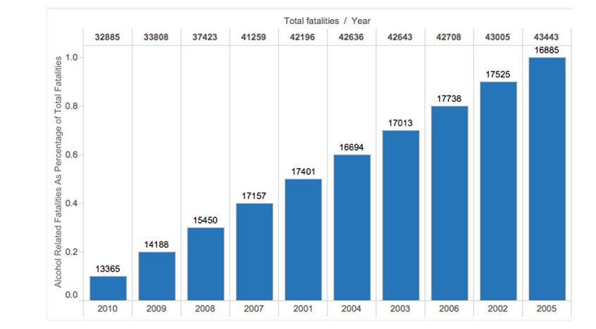
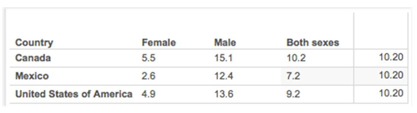
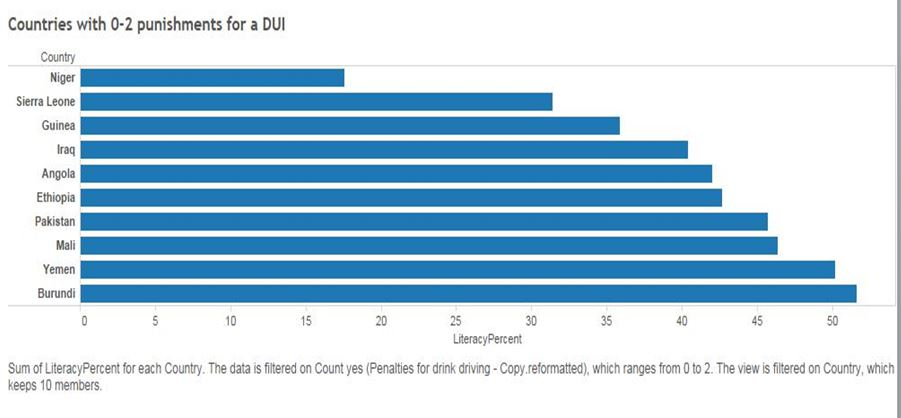
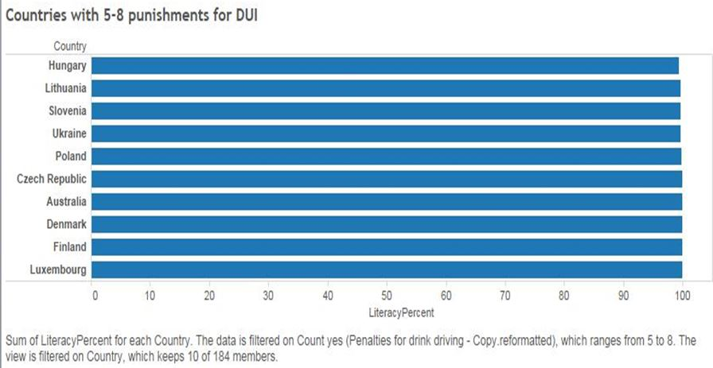
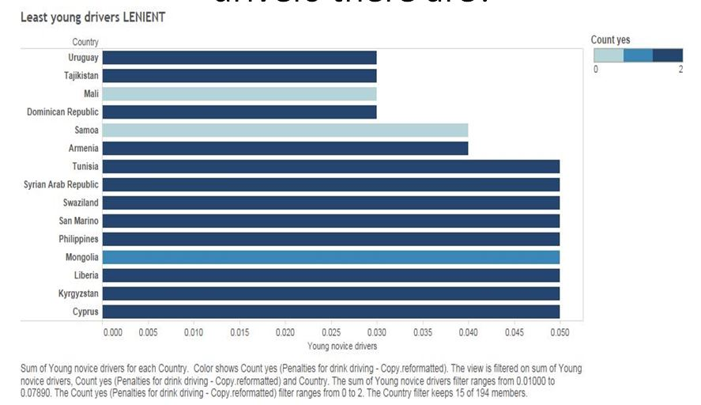
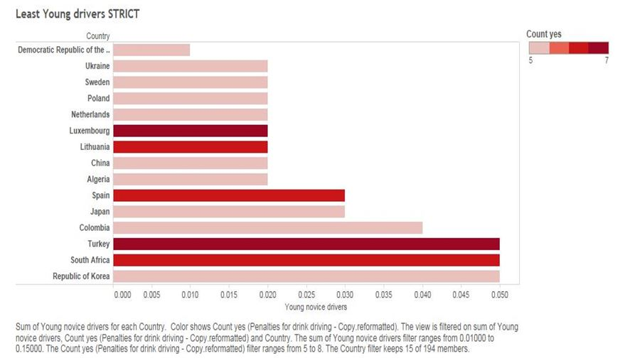
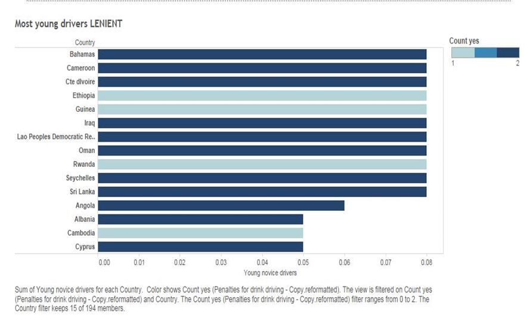
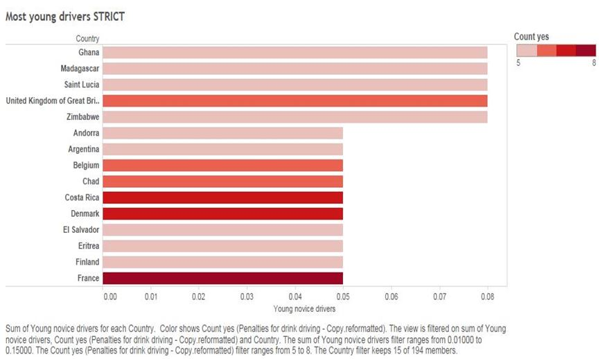

Data used:

WHO Data: 
http://apps.who.int/gho/data/node.main.GISAH?lang=en

USA Department of Transportation Statistics: 
http://www.rita.dot.gov/bts/sites/rita.dot.gov.bts/files/publications/by_the_numbers/drunk_driving/index.html


Reformatting the Data and visualizing plots of alcohol abstainers

```{r}
source("../01 Data/abstainers.R", echo = TRUE)
```

Reformatting the Data and visualizing plots of alcohol consumption by type


```{r}
source("../01 Data/Consumptionbyalcohol.R", echo = TRUE)
```


Reformatting the Data and visualizing plots of economic costs


```{r}
source("../01 Data/Costs.R", echo = TRUE)
```

Reformatting the Plots of Drinking Policies

```{r}
source("../01 Data/Drinking policies.R", echo = TRUE)
```

Reformatting and Visualizing Drunk Driving Statistics

```{r}
source("../01 Data/Drunk_driving.R", echo = TRUE)
```

Datawrangling policy and Alcohol 

```{r}
source("../02 Data Wrangling/Datawrangling.R", echo = TRUE)
```


Tableu Visualizations: 

      

Based on year, ranked by Alcohol use fatalities from 1st to 10th highest.

      

Rank from 0-1
Lowest to highest total fatalities based on year
Adds alcohol related fatalities amount above

      

Used nth value 
Filtered by year 2008-2010, and filtered by just north american countries 
Canada has both total consumption between men and women





      


      

These countries have a low percent of young drivers, regardless they employ a high if not all amount of punishments for being caught driving under the influence

      

I thought maybe that having a high percent of young drivers a country would be more strict in the amount of punishments for a DUI. Our data did not support this however.
Even though these countries had a lot of young drivers on the streets it did not affect the amount of punishments they'd administer.

      


These countries have the most amount of young drivers and take drunk driving very seriously employing many different punishments for drunk driving


